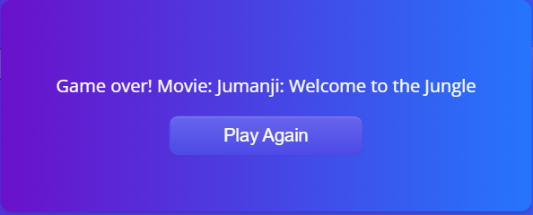

## Movie-Guess 🎬
A web application for guessing movies built with .NET and React.js.
Test your movie knowledge! Guess the hidden movie using clues and color-coded feedback.

## About

- [Features](#features)
- [How to Play](#how-to-play)
- [Screenshots](#screenshots)

---

 ## Features

- Guess the Movie: Input a movie title and see how close you are!

- Hints: Additional clues like Oscar wins and movie duration.

- Color-Coded Feedback: Tiles change color based on correctness.

- 10 Guesses: Limited attempts to keep the game challenging.

- Detailed Feedback: Each guess reveals info about the movie's name, country, director, actor, year, and genre.

---

## How to Play 

- Enter a movie title in the input field and submit your guess.

- Win by guessing the movie correctly and earn up to 100 points!

- Game Over after 10 incorrect guesses—the answer will be revealed.

---

## Screenshots
Game UI  

Guess Feedback  

Correct Guess  

Game Modals  

    
    

